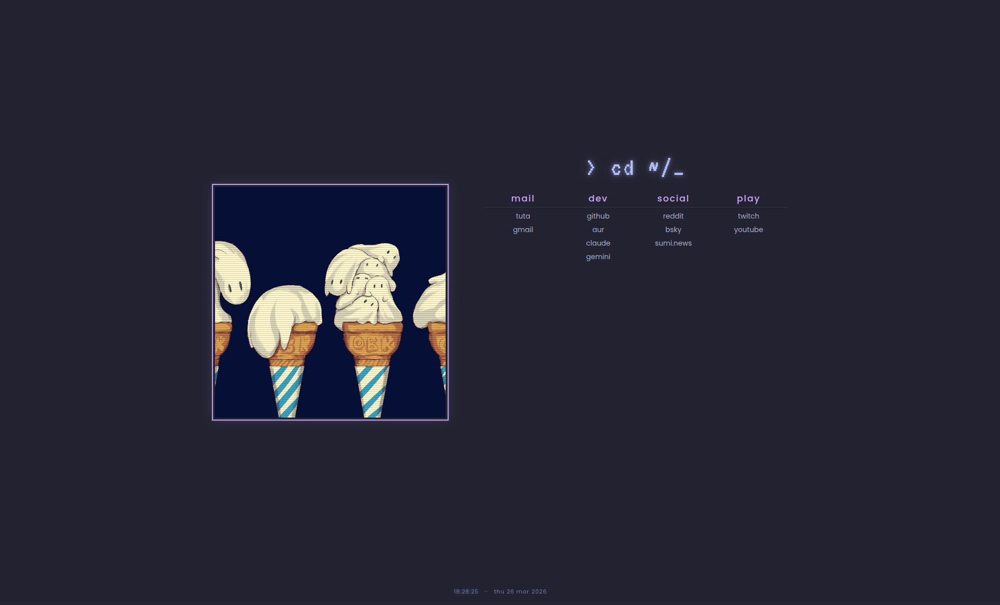

# ~/startpage

A minimal browser startpage with a terminal / 90s CRT aesthetic.



## Features

- Categorized bookmarks
- Live clock with date, fixed at bottom-center
- Blinking cursor animation
- Custom `> _` favicon (Catppuccin Mocha colors)
- [Catppuccin Mocha](https://github.com/catppuccin/catppuccin) color scheme
- Random image on every page load
- CRT scanline effect on image and page background
- Phosphor glow on heading and links
- Pixel-style border around image

## Fonts

- [Poppins](https://fonts.google.com/specimen/Poppins) — everything readable: links, clock, category titles
- [VT323](https://fonts.google.com/specimen/VT323) — heading only, for the retro terminal look

Both loaded via Google Fonts, no install needed.

## Usage

Clone or download the repo, then open `index.html` in your browser. Set it as your browser's homepage or use an extension like [New Tab Redirect](https://chromewebstore.google.com/detail/new-tab-redirect/icpgjfneehieebagbmdbhnlpiopdcmna).

```
git clone https://github.com/yourusername/startpage
```

Make sure all image files are in the same folder as `index.html`:

```
startpage/
├── index.html
├── style.css
├── cat.webp
├── 001.webp
├── 002.webp
└── ...
```

## Adding images

Open `index.html` and add your filename to the `images` array in the script at the bottom:

```js
const images = [
    'cat.webp',
    '001.webp',
    '002.webp',
    '010.webp',  // ← add new files here
];
```

Then drop the file in the same folder. No other changes needed.

## Customization

Edit bookmark links directly in `index.html`. Colors are all CSS variables in `style.css`:

```css
--color-bg:           var(--ctp-base);
--color-fg:           var(--ctp-text);
--color-link:         var(--ctp-subtext0);
--color-link-visited: var(--ctp-lavender);
--color-link-hover:   var(--ctp-mauve);
```

Swap any `--ctp-*` token to change the accent. Available: `--ctp-blue`, `--ctp-teal`, `--ctp-green`, `--ctp-peach`, `--ctp-pink`, `--ctp-mauve`.

## Credits

[Cat GIF/Pictures artist Avogado6](https://x.com/avogado6/status/1165595520967954432)

[Startpage inspired by kencx](https://github.com/kencx/startpage)
