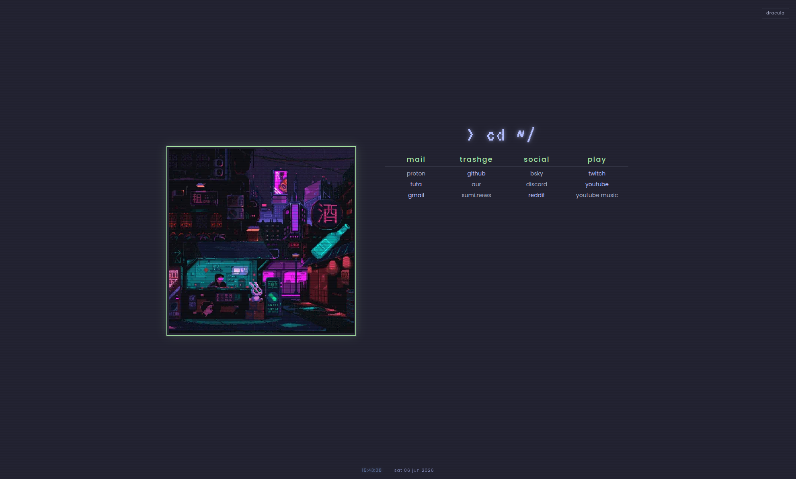
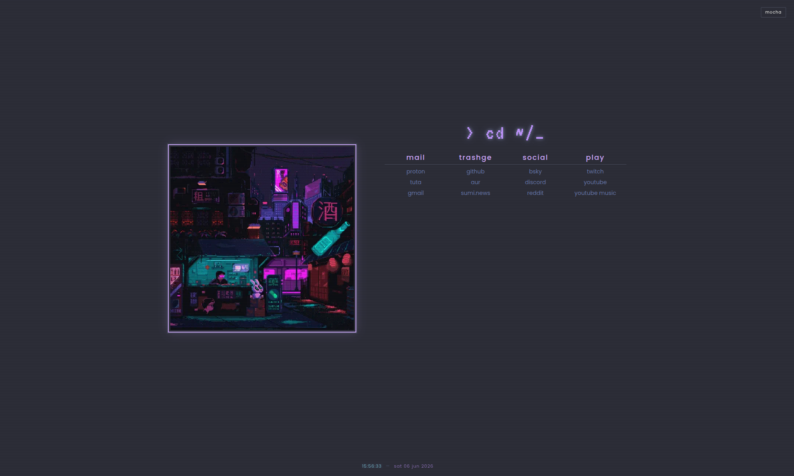

# ~/startpage

A minimal browser startpage with a terminal / 90s CRT aesthetic.




## Features

- Categorized bookmarks
- Live clock with date, fixed at bottom-center
- Blinking cursor animation
- Custom `> _` favicon
- Theme switcher — cycles between **Dracula** (default) and **Catppuccin Mocha** with a random accent color on every switch
- CRT scanline effect on image and page background
- Phosphor glow on heading and links
- Pixel-style border around image, accent-colored per theme

## Themes

| Theme | Description |
|---|---|
| [Dracula](https://draculatheme.com) | Default. Dark purple palette |
| [Catppuccin Mocha](https://github.com/catppuccin/catppuccin) | Picks a random accent on every switch — rosewater, flamingo, pink, mauve, red, maroon, peach, yellow, green, teal, sky, sapphire, blue, or lavender |

Theme preference is saved across sessions via `localStorage`.

## Fonts

- [Poppins](https://fonts.google.com/specimen/Poppins) — everything readable: links, clock, category titles
- [VT323](https://fonts.google.com/specimen/VT323) — heading only, for the retro terminal look

Both loaded via Google Fonts, no install needed.

## Usage

Clone or download the repo, then open `index.html` in your browser. Set it as your browser's homepage or use an extension like [New Tab Redirect](https://chromewebstore.google.com/detail/new-tab-redirect/icpgjfneehieebagbmdbhnlpiopdcmna).

```
git clone https://github.com/yourusername/startpage
```

File structure:

```
startpage/
├── index.html
├── style.css
└── cat.webp        ← swap this for any image you like
```

To use a different image, update the `src` in `index.html`:

```html

```

## Customization

Edit bookmark links directly in `index.html`. To add a new category, copy an existing `.category` block and update the title and links.

To change which Mocha accent colors are available, edit the `mochaAccents` array in the script at the bottom of `index.html`:

```js
const mochaAccents = [
    { name: 'mauve', hex: '#cba6f7' },
    { name: 'blue',  hex: '#89b4fa' },
    // add or remove entries here
];
```

## Credits

[Cat artwork by Avogado6](https://x.com/avogado6/status/1165595520967954432)

[Startpage inspired by kencx](https://github.com/kencx/startpage)
